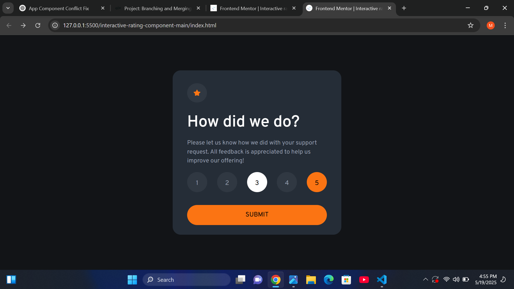

# Frontend Mentor - Interactive rating component solution

This is a solution to the [Interactive rating component challenge on Frontend Mentor](https://www.frontendmentor.io/challenges/interactive-rating-component-koxpeBUmI). Frontend Mentor challenges help you improve your coding skills by building realistic projects. 

## Table of contents

  - [The challenge](#the-challenge)
  - [Screenshot](#screenshot)
  - [Links](#links)
  - [Built with](#built-with)
  - [What I learned](#what-i-learned)
  - [Continued development](#continued-development)
- [Author](#author)
- [Acknowledgments](#acknowledgments)

### The challenge

Users should be able to:

- View the optimal layout for the app depending on their device's screen size
- See hover states for all interactive elements on the page
- Select and submit a number rating
- See the "Thank you" card state after submitting a rating

### Screenshot

### Links

- Solution URL: [**Solution URL**](https://github.com/devmelody/interactive-rating-component)
- Live Site URL: [**Live Site URL**](https://devmelody.github.io/interactive-rating-component)

### Built with

- Semantic HTML5 markup
- CSS custom properties
- Flexbox

### What I learned

I learnt about local storage and how it works.
More on interactivity plus, I believe I'm getting more comfortable with javascript classes. I don't know why it confuses me often.
DOM manipulation here was a bit of a hassle, but all done thankfully.

### Continued development

Does one ever stop learning Javascript? I'll practice DOM manipulation still.

## Author

- Linkedin - [melCamelCase](https://www.linkedin.com/in/melCamelCase)
- Frontend Mentor - [@devmelody](https://www.frontendmentor.io/profile/devmelody)
- Twitter - [@melCamelCase](https://www.x.com/melCamelCase)

## Acknowledgments

Hmm, I'm a bit disappointed in myself that I took so long to complete this, but it's all good.
